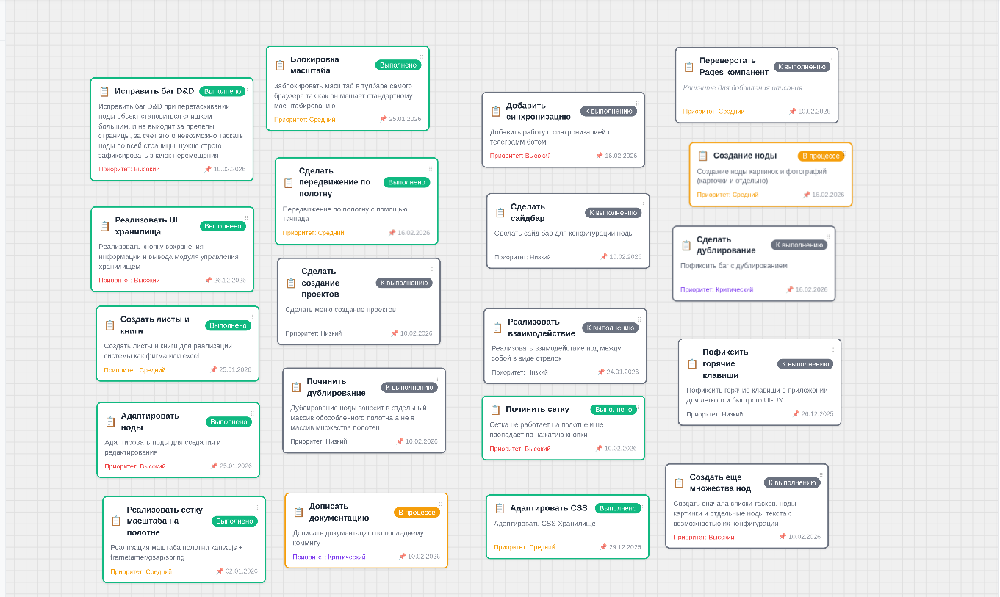

<h1 align="center">🎨 Lil Papper - Canvas Todo App</h1> 

<p align="center">
  <strong>Интерактивное приложение для управления задачами на бесконечном холсте</strong><br />
  с поддержкой изображений, проектов и продвинутым Drag & Drop
</p>

<p align="center">
  
</p>

<p align="center">
  
  
  
  
  
</p>

<p align="center">
  
</p>

<hr />


## Наполнение проекта

```bash
    src/
├── 📂 app/                   # 🏠 ЯДРО ПРИЛОЖЕНИЯ (настройки и запуск)
│   ├── 📂 providers/         # 🔌 ПРОВОДКА (обертки для библиотек)
│   │   ├── StoreProvider/    # 🗃️ Redux хранилище данных
│   │   ├── ThemeProvider/    # 🎨 Темы (светлая/темная)
│   │   └── DndProvider/      # 🖱️ Настройки Drag & Drop
│   ├── 📂 styles/            # 🖌️ ГЛОБАЛЬНЫЕ СТИЛИ
│   │   ├── global.css        # 🌍 Основные стили всего приложения
│   │   └── variables.css     # 🎯 CSS переменные (цвета, шрифты)
│   └── App.tsx              # 🚪 ВХОДНАЯ ДВЕРЬ (главный компонент)
│
├── 📂 entities/              # 🏢 СУЩНОСТИ (что есть в приложении)
│   └── 📂 todo/              # 📝 СУЩНОСТЬ "ЗАДАЧА"
│   │   ├── 📂 model/         # 📊 МОДЕЛЬ ДАННЫХ
│   │   │   ├── types.ts      # 📐 ТИПЫ TypeScript (описание задачи)
│   │   │   └── api.ts        # 🌐 API запросы к серверу
│   │   ├── 📂 lib/           # 🧰 ИНСТРУМЕНТЫ ДЛЯ ЗАДАЧ
│   │   │   └── todoUtils.ts  # ⚙️ Функции для работы с задачами
│   │   └── 📂 ui/            # 👁️ БАЗОВЫЙ ВИД ЗАДАЧИ
│   │        └── TodoCard/     # 🎴 Карточка задачи (минимум стилей)
│   ├── 📂 canvas/   # 🔍 ЗУМ И ПАНОРАМИРОВАНИЕ
│   │   └── 📂 model/         # 💾 ДАННЫЕ И СОСТОЯНИЕ
│   │   │   ├── api.ts        # 🔍 Api для листов и проектов
│   │   │   └── types.ts      # 🗃️ Типы данных для canvas листов
│   │   └── 📂 lib/         # 🧰 ИНСТРУМЕНТЫ ДЛЯ Проектов
│   └── 📂 image/   # 🔍 РАБОТА С Изображениями
│       └── 📂 model/         # 💾 ДАННЫЕ И СОСТОЯНИЕ
│       │   ├── api.ts        # 🔍 Api для images
│       │   └── types.ts      # 🗃️ Типы данных для images
│       └── 📂 lib/         # 🧰 ИНСТРУМЕНТЫ ДЛЯ Проектов
│           └── imageHelpers.ts        
├── 📂 features/              # 🎯 ФИЧИ (что можно делать)
│   ├── 📂 todo-nodes/        # 🎯 НОДЫ-ЗАДАЧИ НА ХОЛСТЕ
│   │   ├── 📂 lib/           # 🧠 ЛОГИКА
│   │   │   └── useTodoNode=.ts     # 🪝 Хук для работы с нодой
│   │   │   └── todoNodeHelpers.ts # 🔧 Вспомогательные функции
│   │   ├── 📂 model/         # 💾 ДАННЫЕ И СОСТОЯНИЕ
│   │   │   ├── types.ts      # 📐 Типы для нод
│   │   │   ├── slice.ts      # 🗃️ Redux slice (хранилище)
│   │   │   └── selectors.ts  # 🔍 Функции для получения данных
│   │   └── 📂 ui/            # 👁️ ИНТЕРФЕЙС
│   │       ├── KanvaTodoNode/ # 🎴 Компонент ноды для канвас холста
│   │       └── TodoNode/     # 🎴 Компонент ноды
│   ├── 📂 image-upload/        # 🎯 Изображения НА ХОЛСТЕ
│   │   ├── 📂 lib/           # 🧠 ЛОГИКА
│   │   │   └── imageProcessprs.ts # загрузка изображений
│   │   │   └── useImageDrop.ts # D&D изображений
│   │   │   └── useImageUpload.ts # загрузка на холст изображений
│   │   ├── 📂 model/         # 💾 ДАННЫЕ И СОСТОЯНИЕ
│   │   │   ├── slice.ts      # 🗃️ Redux slice (хранилище)
│   │   │   └── selectors.ts  # 🔍 Функции для получения данных
│   │   └── 📂 ui/            # 👁️ ИНТЕРФЕЙС
│   │       ├── ImageDropOverlay/ # 🎴 Компонент ноды для загрузки d&d
│   │       └── ImageNode/     # 🎴 Компонент ноды изображений
│   │       └── ImageUploadButton/     # 🎴 Компонент кнопки загрузки изображений
│   ├── 📂 nodes-creations/   # 🎯 НОДЫ-ЗАДАЧИ НА ХОЛСТЕ
│   │   ├── 📂 lib/           # 🧠 ЛОГИКА
│   │   │   ├── contextMenuHelpers.ts  # 🪝 Хук для работы с меню пунктами
│   │   │   └── useContextMenu  # 🔧 Работа функций контекстного меню
│   │   ├── 📂 model/         # 💾 ДАННЫЕ И СОСТОЯНИЕ
│   │   │   ├── types.ts      # 📐 Типы для нод
│   │   │   └── slice.ts      # 🗃️ Redux slice (хранилище)
│   │   └── 📂 ui/            # 👁️ ИНТЕРФЕЙС
│   │       ├── СontextMenu/  # 🎴 Компонент ноды
│   │       ├── MenuDivider/  # 📝 Форма создания/редактирования
│   │       └── MenuItem/     # 📋 Список нод (если понадобится)
│   ├── 📂 todo-form/         # 🎯 Форма для создания Ноды
│   │   ├── 📂 lib/           # 🧠 ЛОГИКА
│   │   │   └── useTodoForm.ts  # 🪝 Хук для работы с формой
│   │   ├── 📂 model/         # 💾 ДАННЫЕ И СОСТОЯНИЕ
│   │   │   ├── types.ts      # 📐 Типы для нод
│   │   │   └── slice.ts      # 🗃️ Redux slice (хранилище)
│   │   └── 📂 ui/            # 👁️ ИНТЕРФЕЙС
│   │       ├── QuickTodoForm/     # 🎴 Быстрая форма создания
│   │       ├── TodoForm/     # 📝 Форма создания/редактирования
│   │       └── TodoFormModal/     # 📋 Форма (если понадобится)
│   ├── 📂 storage/         # 🎯 Форма для просмотра функции автосохранения
│   │   ├── 📂 lib/           # 🧠 ЛОГИКА
│   │   │   └── useAutoSave.ts  # 🪝 Хук для работы Автосохранения
│   │   ├── 📂 model/         # 💾 ДАННЫЕ И СОСТОЯНИЕ
│   │   │   └── autoSaveMiddleware.ts # 🗃️ Redux slice для списка действий у сохранений (хранилище)
│   │   └── 📂 ui/            # 👁️ ИНТЕРФЕЙС
│   │       └── StorageMeneger/     # 🎴 Форма сохранений
│   ├── 📂 canvas-dnd/        # 🖱️ ПЕРЕТАСКИВАНИЕ (Drag & Drop)
│   │   ├── lib/useCanvasDnd.ts    # 🧠 Логика перетаскивания
│   │   ├── model/slice.ts         # 💾 Состояние DnD
│   │   └── model/types.ts     # 📐 Типы для позицианирования нод
│   │
│   ├── 📂 canvas-toolbar/    # 🛠️ ПАНЕЛЬ ИНСТРУМЕНТОВ
│   │   └── ui/Toolbar.tsx         # 👁️ Компонент тулбара
│   │
│   ├── 📂 properties-panel/  # ⚙️ ПАНЕЛЬ СВОЙСТВ
│   │   └── ui/PropertiesPanel.tsx # 👁️ Компонент панели
│   │
│   ├── 📂 canvas-viewport/   # 🔍 ЗУМ И ПАНОРАМИРОВАНИЕ
│   │   ├── 📂 lib/           # 🧠 ЛОГИКА
│   │   │   └── useCanvasViewport.ts # 🧠 Логика зума
│   │   │   └── useTransformViewport.ts # 🧠 Логика масштабирования полотна
│   │   ├── 📂 model/         # 💾 ДАННЫЕ И СОСТОЯНИЕ
│   │   │   ├── selectors.ts  # 🔍 Функции для получения координат нод
│   │   │   ├── types.ts      # 📐 Типы для нод
│   │   │   └── slice.ts      # 🗃️ Redux slice (хранилище)
│   │   └── 📂 ui/            # 👁️ ИНТЕРФЕЙС
│   │       ├── GridRenderer/     # 🎴 Рисование самой сетки
│   │       └── ZoomControls/     # 👁️ Кнопки управления
│   │
│   ├── 📂 project-management/   # 🔍 ЗУМ И ПАНОРАМИРОВАНИЕ
│   │   └── 📂 model/         # 💾 ДАННЫЕ И СОСТОЯНИЕ
│   │       ├── selectors.ts  # 🔍 Функции для получения координат нод
│   │       └── slice.ts      # 🗃️ Redux slice (хранилище)
│   │
│   └── 📂 selection/         # ☑️ ВЫДЕЛЕНИЕ ЭЛЕМЕНТОВ
│       └── lib/useSelection.ts     # 🧠 Логика выделения
│
├── 📂 widgets/               # 🧩 ГОТОВЫЕ БЛОКИ (комнаты)
│   ├── 📂 workspace-layout/  # 📐 МАКЕТ РАБОЧЕЙ ОБЛАСТИ
│   │   └── ui/WorkspaceLayout.tsx # 👁️ Компонент макета
│   │
│   └── 📂 pages-workspace/  # 🎨 Панель со страницами
│   │   └── ui/PageItem/ # 👁️ Компонент Item-ов
│   │   └── ui/PagesSidebar/ # 👁️ Компонент сайд панели
│   │
│   └── 📂 canvas-workspace/  # 🎨 ХОЛСТ С ИНСТРУМЕНТАМИ
│       └── ui/CanvasWorkspace/ # 👁️ Компонент холста
│       └── ui/KonvaCanvasWorkspace/ # 👁️ Компонент холста матричного приближения (Konva.js)
│
├── 📂 processes/             # 🔄 ПРОЦЕССЫ (сложные действия)
│   └── 📂 canvas-actions/    # ✨ СЛОЖНЫЕ ДЕЙСТВИЯ С ХОЛСТОМ
│   └── 📂 canvas-sync/    # ✨ Синхронизация листов с холстами
│       └── 📂 lib/    # ✨ Логика работы синхронизации
│            └── 📂 canvasSyncMiddleware/  # ✨ Файл логики синхронизации (Создания, удаления, обновления нод)
│
└── 📂 shared/                # 🤝 ОБЩИЙ КОД (все используют)
    ├── 📂 api/               # 🌐 РАБОТА С СЕРВЕРОМ
    │   └── storage/                 # Хранилища
    │       └── jsonStorage/         # Json хранилище
    │           └── localStorage.ts  # Функция локального хранилища
    │           └── todoStorage.ts   #🔄 Функции работы хранилища с нодами заметок  
    │
    ├── 📂 lib/               # 🧰 ИНСТРУМЕНТЫ И УТИЛИТЫ
    │   ├── 📂 geometry/      # 📐 ГЕОМЕТРИЧЕСКИЕ ФУНКЦИИ
    │   │
    │   ├── 📂 dom/           # 🖥️ РАБОТА С ДОМ
    │   │
    │   ├── 📂 state/         # 🗃️ НАСТРОЙКИ СОСТОЯНИЯ
    │   │   └── store.ts      # ⚙️ Конфигурация Redux store
    │   │   └── index.ts      # Cелектор для viewport
    ├── 📂 ui/                # 🎨 ОБЩИЕ КОМПОНЕНТЫ
    │   ├── 📂 kit/           # 🧩 ДИЗАЙН-СИСТЕМА
    │   │   ├── Modal/        # 🪟 Модальное окно
    │   │   │   ├── DraggableModal.tsx #  Перетаскиваемое окно
    │   │   │   ├── UniversalModal.tsx
    │   │   │   ├── useUniversalModal.ts 
    │   │   │   └── AppModal.tsx # ⚙️ Модальное окно
    │   │   ├── DatePicker/  # 📦 Элемент отслеживающий последнее сохранение
    │   │   ├── ImagePreview/        # 🪟 Модальное окно
    │   │   │   └── ImagePreview.tsx #  Перетаскиваемое окно
    │   └── 📂 icons/         # 🎨 ИКОНКИ
    │
    └── 📂 config/            # ⚙️ КОНФИГУРАЦИИ
        ├── routes.ts         # 🗺️ МАРШРУТЫ (страницы)
        └── env.ts            # 🌍 ПЕРЕМЕННЫЕ ОКРУЖЕНИЯ
```


<h2>📋 О приложении</h2>

<p>

  <strong>Canvas Todo App</strong> — это полноценное визуальное рабочее пространство, 

  <strong>Canvas Todo App</strong> — это не просто очередной список задач, а полноценное визуальное рабочее пространство, 
  вдохновленное такими инструментами как Miro, Figma и Notion. Вместо скучных списков вы получаете <strong>бесконечный холст</strong>, 
  на котором можно размещать задачи, изображения, создавать связи между ними и организовывать проекты любым удобным способом.
</p>

<h3>🚀 Ключевые возможности</h3>

<table>
  <thead>
    <tr>
      <th>Функциональность</th>
      <th>Описание</th>
    </tr>
  </thead>
  <tbody>
    <tr>
      <td><strong>🖱️ Интерактивный холст</strong></td>
      <td>Бесконечное рабочее пространство с зумом и панорамированием (как в Figma)</td>
    </tr>
    <tr>
      <td><strong>📝 Умные задачи</strong></td>
      <td>Задачи с приоритетами, статусами, тегами и сроками. Можно редактировать прямо на холсте</td>
    </tr>
    <tr>
      <td><strong>🖼️ Поддержка изображений</strong></td>
      <td>Drag & Drop изображений из проводника, ресайз, группировка с задачами</td>
    </tr>
    <tr>
      <td><strong>📁 Управление проектами</strong></td>
      <td>Несколько проектов, страницы внутри проектов, навигация между ними</td>
    </tr>
    <tr>
      <td><strong>🎯 Продвинутый Drag & Drop</strong></td>
      <td>Перетаскивание задач и изображений, авто-панорамирование при перетаскивании к краю</td>
    </tr>
    <tr>
      <td><strong>⚡ Производительность</strong></td>
      <td>Оптимизация через requestAnimationFrame, виртуализация, ленивая загрузка</td>
    </tr>
    <tr>
      <td><strong>💾 Автосохранение</strong></td>
      <td>Мгновенное сохранение всех изменений в localStorage</td>
    </tr>
  </tbody>
</table>

<hr />

<h2>🏗️ Архитектура приложения</h2>

<h3>🎯 Почему Feature-Sliced Design?</h3>

<p>
  Мы выбрали <strong>Feature-Sliced Design (FSD)</strong> — современный подход к организации React-приложений, 
  который обеспечивает:
</p>

<ul>
  <li><strong>Масштабируемость</strong> — приложение может расти без потери качества кода</li>
  <li><strong>Поддерживаемость</strong> — четкие границы между модулями упрощают поиск кода</li>
  <li><strong>Переиспользуемость</strong> — общие компоненты вынесены в shared</li>
  <li><strong>Тестируемость</strong> — изолированные фичи легко тестировать</li>
  <li><strong>Командная работа</strong> — разработчики могут работать над разными фичами без конфликтов</li>
</ul>

<h3>🔧 Технические детали реализации</h3>

<h4>1. Canvas рендеринг</h4>
<p>
  В приложении используется <strong>гибридный подход</strong> к рендерингу холста:
</p>
<ul>
  <li><strong>CSS трансформации</strong> — для позиционирования HTML-элементов (задачи, изображения)</li>
  <li><strong>React-Konva</strong> — для рисования сетки и сложных графических элементов (в разработке)</li>
</ul>
<p>Это позволяет сочетать простоту разработки с производительностью.</p>

<h4>2. Система координат</h4>
<p>
  Одна из ключевых сложностей Canvas-приложений — работа с координатами. В приложении реализована 
  <strong>двухуровневая система координат</strong>:
</p>
<pre><code>Экранные координаты (clientX, clientY) → Относительные координаты canvas → Canvas координаты</code></pre>
<p>
  Все перемещения элементов конвертируются с учетом текущего зума и панорамирования, что обеспечивает 
  точное позиционирование при любом масштабе.
</p>

<h4>3. Управление состоянием</h4>
<p>
  <strong>Redux Toolkit</strong> используется с разделением на предметные области (slices):
</p>
<ul>
  <li><code>todoNodes</code> — состояние задач</li>
  <li><code>imageNodes</code> — состояние изображений</li>
  <li><code>viewport</code> — зум и панорамирование</li>
  <li><code>canvasDnd</code> — состояние перетаскивания</li>
  <li><code>project</code> — управление проектами и страницами</li>
</ul>

<h4>4. Drag & Drop система</h4>
<p>
  Реализована <strong>кастомная DnD система</strong> с поддержкой:
</p>
<ul>
  <li>Перетаскивания задач и изображений</li>
  <li>Авто-панорамирования при перетаскивании к краю</li>
  <li>Throttling через requestAnimationFrame для плавности</li>
  <li>Визуального preview при перетаскивании</li>
</ul>

<h4>5. Работа с изображениями</h4>
<p>
  Изображения проходят через <strong>конвейер обработки</strong>:
</p>
<ol>
  <li>Валидация формата и размера (до 10MB)</li>
  <li>Чтение FileReader API</li>
  <li>Оптимизация размеров (макс. 400x300)</li>
  <li>Конвертация в base64</li>
  <li>Создание ноды изображения на холсте</li>
</ol>

<h4>6. Проекты и страницы</h4>
<p>
  Реализована <strong>иерархическая структура</strong>:
</p>
<pre><code>Проект → Страницы → Холсты → Элементы (задачи + изображения)</code></pre>
<p>
  Каждая страница имеет свой холст с независимым viewport, сеткой и фоном. 
  Элементы могут перемещаться между страницами через drag & drop.
</p>

<hr />

<h2>📁 Полная структура проекта</h2>

<pre><code>src/
├── 📂 app/                    # 🏠 ЯДРО ПРИЛОЖЕНИЯ
│   ├── 📂 providers/          # 🔌 ПРОВАЙДЕРЫ
│   │   ├── StoreProvider/     # 🗃️ Redux хранилище
│   │   ├── ThemeProvider/     # 🎨 Темы (светлая/темная)
│   │   └── DndProvider/       # 🖱️ Drag & Drop
│   ├── 📂 styles/             # 🖌️ ГЛОБАЛЬНЫЕ СТИЛИ
│   │   ├── global.css
│   │   └── variables.css
│   └── App.tsx                # 🚪 ГЛАВНЫЙ КОМПОНЕНТ
│
├── 📂 entities/                # 🏢 БИЗНЕС-СУЩНОСТИ
│   ├── 📂 todo/                # 📝 СУЩНОСТЬ "ЗАДАЧА"
│   │   ├── 📂 model/
│   │   │   ├── types.ts
│   │   │   └── api.ts
│   │   ├── 📂 lib/
│   │   │   └── todoUtils.ts
│   │   └── 📂 ui/
│   │       └── TodoCard/
│   │
│   ├── 📂 canvas/              # 🖼️ СУЩНОСТЬ "КАНВАС"
│   │   ├── 📂 model/
│   │   │   ├── types.ts
│   │   │   └── api.ts
│   │   └── 📂 lib/
│   │       └── canvasHelpers.ts
│   │
│   └── 📂 image/               # 🖼️ СУЩНОСТЬ "ИЗОБРАЖЕНИЕ"
│       ├── 📂 model/
│       │   └── types.ts
│       └── 📂 lib/
│           └── imageHelpers.ts
│
├── 📂 features/                # 🎯 ПОЛЬЗОВАТЕЛЬСКИЕ СЦЕНАРИИ
│   ├── 📂 todo-nodes/          # 🎯 НОДЫ-ЗАДАЧИ
│   │   ├── 📂 lib/
│   │   │   ├── useTodoNode.ts
│   │   │   └── todoNodeHelpers.ts
│   │   ├── 📂 model/
│   │   │   ├── types.ts
│   │   │   ├── slice.ts
│   │   │   └── selectors.ts
│   │   └── 📂 ui/
│   │       ├── KanvaTodoNode/
│   │       └── TodoNode/
│   │
│   ├── 📂 image-upload/        # 🎯 ЗАГРУЗКА ИЗОБРАЖЕНИЙ
│   │   ├── 📂 lib/
│   │   │   ├── imageProcessor.ts
│   │   │   ├── useImageDrop.ts
│   │   │   └── useImageUpload.ts
│   │   ├── 📂 model/
│   │   │   ├── slice.ts
│   │   │   └── selectors.ts
│   │   └── 📂 ui/
│   │       ├── ImageNode/
│   │       ├── ImageDropOverlay/
│   │       └── ImageUploadButton/
│   │
│   ├── 📂 nodes-creations/     # 🎯 СОЗДАНИЕ НОД
│   │   ├── 📂 lib/
│   │   │   ├── contextMenuHelpers.ts
│   │   │   └── useContextMenu.ts
│   │   ├── 📂 model/
│   │   │   ├── types.ts
│   │   │   └── slice.ts
│   │   └── 📂 ui/
│   │       ├── ContextMenu/
│   │       ├── MenuDivider/
│   │       └── MenuItem/
│   │
│   ├── 📂 todo-form/           # 🎯 ФОРМА ЗАДАЧ
│   │   ├── 📂 lib/
│   │   │   └── useTodoForm.ts
│   │   ├── 📂 model/
│   │   │   ├── types.ts
│   │   │   └── slice.ts
│   │   └── 📂 ui/
│   │       ├── QuickTodoForm/
│   │       ├── TodoForm/
│   │       └── TodoFormModal/
│   │
│   ├── 📂 storage/             # 💾 АВТОСОХРАНЕНИЕ
│   │   ├── 📂 lib/
│   │   │   └── useAutoSave.ts
│   │   ├── 📂 model/
│   │   │   └── autoSaveMiddleware.ts
│   │   └── 📂 ui/
│   │       └── StorageManager/
│   │
│   ├── 📂 canvas-dnd/          # 🖱️ DRAG & DROP
│   │   ├── 📂 lib/
│   │   │   └── useCanvasDnd.ts
│   │   ├── 📂 model/
│   │   │   ├── slice.ts
│   │   │   └── types.ts
│   │   └── 📂 ui/
│   │
│   ├── 📂 canvas-toolbar/      # 🛠️ ПАНЕЛЬ ИНСТРУМЕНТОВ
│   │   └── 📂 ui/
│   │       └── Toolbar.tsx
│   │
│   ├── 📂 properties-panel/    # ⚙️ ПАНЕЛЬ СВОЙСТВ
│   │   └── 📂 ui/
│   │       └── PropertiesPanel.tsx
│   │
│   ├── 📂 canvas-viewport/     # 🔍 ЗУМ И ПАНОРАМИРОВАНИЕ
│   │   ├── 📂 lib/
│   │   │   ├── useCanvasViewport.ts
│   │   │   ├── useEnhancedViewport.ts
│   │   │   └── useAutoPan.ts
│   │   ├── 📂 model/
│   │   │   ├── slice.ts
│   │   │   ├── types.ts
│   │   │   └── selectors.ts
│   │   └── 📂 ui/
│   │       ├── GridRenderer/
│   │       └── ZoomControls/
│   │
│   ├── 📂 project-management/  # 📁 УПРАВЛЕНИЕ ПРОЕКТАМИ
│   │   └── 📂 model/
│   │       ├── slice.ts
│   │       └── selectors.ts
│   │
│   └── 📂 selection/           # ☑️ ВЫДЕЛЕНИЕ
│       └── 📂 lib/
│           └── useSelection.ts
│
├── 📂 widgets/                 # 🧩 ГОТОВЫЕ UI БЛОКИ
│   ├── 📂 workspace-layout/    # 📐 МАКЕТ
│   │   └── 📂 ui/
│   │       └── WorkspaceLayout.tsx
│   │
│   ├── 📂 pages-workspace/     # 📄 ПАНЕЛЬ СТРАНИЦ
│   │   └── 📂 ui/
│   │       ├── PageItem/
│   │       └── PagesSidebar/
│   │
│   └── 📂 canvas-workspace/    # 🎨 ХОЛСТ
│       └── 📂 ui/
│           ├── CanvasWorkspace/
│           └── KonvaCanvasWorkspace/
│
├── 📂 processes/               # 🔄 СЛОЖНЫЕ ПРОЦЕССЫ
│   ├── 📂 canvas-actions/      # ✨ ДЕЙСТВИЯ С ХОЛСТОМ
│   │   └── 📂 lib/
│   │
│   └── 📂 canvas-sync/         # 🔄 СИНХРОНИЗАЦИЯ
│       └── 📂 lib/
│           └── canvasSyncMiddleware/
│
└── 📂 shared/                  # 🤝 ОБЩИЙ КОД
    ├── 📂 api/                  # 🌐 API
    │   └── 📂 storage/
    │       └── 📂 jsonStorage/
    │           ├── localStorage.ts
    │           └── todoStorage.ts
    │
    ├── 📂 lib/                  # 🧰 УТИЛИТЫ
    │   ├── 📂 geometry/
    │   ├── 📂 dom/
    │   └── 📂 state/
    │       ├── store.ts
    │       └── index.ts
    │
    ├── 📂 ui/                    # 🎨 ОБЩИЕ КОМПОНЕНТЫ
    │   ├── 📂 kit/
    │   │   ├── 📂 Modal/
    │   │   │   ├── DraggableModal.tsx
    │   │   │   ├── UniversalModal.tsx
    │   │   │   ├── useUniversalModal.ts
    │   │   │   └── AppModal.tsx
    │   │   ├── 📂 DatePicker/
    │   │   └── 📂 ImagePreview/
    │   │       └── ImagePreview.tsx
    │   └── 📂 icons/
    │
    └── 📂 config/               # ⚙️ КОНФИГУРАЦИЯ
        ├── routes.ts
        └── env.ts</code></pre>

<hr />

<h2>🎯 Назначение каждого слоя</h2>

<h3>1️⃣ <strong>app/</strong> — Фундамент приложения</h3>
<p><strong>Назначение:</strong> Инициализация, провайдеры, глобальные настройки</p>

<pre><code>app/
├── providers/     # Обертки для библиотек (Redux, Theme, DnD)
├── styles/        # Глобальные CSS переменные
└── App.tsx        # Корневой компонент</code></pre>

<h3>2️⃣ <strong>entities/</strong> — Бизнес-сущности</h3>
<p><strong>Назначение:</strong> Описание бизнес-логики и данных</p>

<pre><code>entities/{entity}/
├── model/    # Типы, интерфейсы, DTO
├── lib/      # Чистые функции, утилиты
└── ui/       # Базовые компоненты (опционально)</code></pre>

<p><strong>Сущности проекта:</strong></p>
<ul>
  <li><code>todo/</code> — задачи</li>
  <li><code>canvas/</code> — холсты и листы</li>
  <li><code>image/</code> — изображения</li>
</ul>

<h3>3️⃣ <strong>features/</strong> — Пользовательские сценарии</h3>
<p><strong>Назначение:</strong> Реализация конкретных функций</p>

<pre><code>features/{feature}/
├── lib/     # React хуки, логика
├── model/   # Redux slice, типы, селекторы
└── ui/      # Компоненты фичи</code></pre>

<p><strong>Основные фичи:</strong></p>
<ul>
  <li><code>todo-nodes/</code> — работа с задачами на холсте</li>
  <li><code>image-upload/</code> — загрузка и работа с изображениями</li>
  <li><code>canvas-viewport/</code> — зум и панорамирование</li>
  <li><code>canvas-dnd/</code> — перетаскивание элементов</li>
  <li><code>project-management/</code> — управление проектами</li>
</ul>

<h3>4️⃣ <strong>widgets/</strong> — Композитные UI блоки</h3>
<p><strong>Назначение:</strong> Сборка нескольких features в готовые блоки</p>

<pre><code>widgets/{widget}/
└── ui/     # Компоненты</code></pre>

<p><strong>Виджеты:</strong></p>
<ul>
  <li><code>workspace-layout/</code> — макет рабочей области</li>
  <li><code>canvas-workspace/</code> — холст с инструментами</li>
  <li><code>pages-workspace/</code> — панель страниц</li>
</ul>

<h3>5️⃣ <strong>processes/</strong> — Сложные бизнес-процессы</h3>
<p><strong>Назначение:</strong> Координация нескольких features</p>

<pre><code>processes/{process}/
└── lib/     # Логика процессов</code></pre>

<p><strong>Процессы:</strong></p>
<ul>
  <li><code>canvas-sync/</code> — синхронизация холстов</li>
  <li><code>canvas-actions/</code> — комплексные действия</li>
</ul>

<h3>6️⃣ <strong>shared/</strong> — Общий код</h3>
<p><strong>Назначение:</strong> Переиспользуемые утилиты и компоненты</p>

<pre><code>shared/
├── api/          # HTTP клиент, работа с хранилищем
├── lib/          # Утилиты (geometry, dom, state)
├── ui/kit/       # Дизайн-система (Modal, DatePicker, ImagePreview)
├── ui/icons/     # Иконки
└── config/       # Конфигурации (routes, env)</code></pre>

<hr />

<h2>🔄 Правила зависимостей</h2>

<pre><code>app/ ← processes/ ← features/ ← entities/ ← shared/
       widgets/ могут зависеть от всех слоев</code></pre>

<p><strong>Основное правило:</strong> Зависимости могут идти только от более высоких слоев к более низким.</p>

<p>❌ <strong>Неправильно:</strong> <code>features/</code> импортирует из <code>widgets/</code><br />
✅ <strong>Правильно:</strong> <code>widgets/</code> импортирует из <code>features/</code></p>

<hr />

<h2>🚀 Как добавить новую функциональность</h2>

<h3>Пример: Добавление системы комментариев</h3>

<p><strong>1. Создайте сущность</strong> (если ее нет):</p>

<pre><code>mkdir -p src/entities/comment/{model,lib,ui}</code></pre>

<p><strong>2. Создайте feature</strong> для работы с комментариями:</p>

<pre><code>mkdir -p src/features/comments/{lib,model,ui}</code></pre>

<p><strong>3. Создайте widget</strong> для отображения (если нужно):</p>

<pre><code>mkdir -p src/widgets/comments-panel/{lib,model,ui}</code></pre>

<p><strong>4. Настройте зависимости:</strong></p>
<ul>
  <li><code>features/comments/</code> зависит от <code>entities/comment/</code></li>
  <li><code>widgets/comments-panel/</code> зависит от <code>features/comments/</code></li>
</ul>

<hr />

<h2>📦 Стек технологий</h2>

<h3>Основные</h3>
<table>
  <thead>
    <tr>
      <th>Технология</th>
      <th>Назначение</th>
    </tr>
  </thead>
  <tbody>
    <tr>
      <td>React 18</td>
      <td>UI библиотека</td>
    </tr>
    <tr>
      <td>TypeScript</td>
      <td>Типизация</td>
    </tr>
    <tr>
      <td>Redux Toolkit</td>
      <td>Управление состоянием</td>
    </tr>
    <tr>
      <td>React-Konva</td>
      <td>Работа с Canvas</td>
    </tr>
    <tr>
      <td>@dnd-kit</td>
      <td>Drag & Drop</td>
    </tr>
  </tbody>
</table>

<h3>Утилиты</h3>
<table>
  <thead>
    <tr>
      <th>Технология</th>
      <th>Назначение</th>
    </tr>
  </thead>
  <tbody>
    <tr>
      <td>date-fns</td>
      <td>Работа с датами</td>
    </tr>
    <tr>
      <td>nanoid</td>
      <td>Генерация ID</td>
    </tr>
    <tr>
      <td>clsx</td>
      <td>Условные CSS классы</td>
    </tr>
  </tbody>
</table>

<hr />

<h2>🛠️ Команды разработки</h2>

<pre><code># Запуск в режиме разработки
npm run dev

# Сборка для production
npm run build

# Проверка TypeScript типов
npm run type-check

# Линтинг кода
npm run lint

# Форматирование кода
npm run format</code></pre>

<hr />

<h2>📊 Статус реализации</h2>

<table>
  <thead>
    <tr>
      <th>Компонент</th>
      <th>Статус</th>
    </tr>
  </thead>
  <tbody>
    <tr>
      <td>Задачи (Todo)</td>
      <td>✅ Готово</td>
    </tr>
    <tr>
      <td>Холст (Canvas)</td>
      <td>✅ Готово</td>
    </tr>
    <tr>
      <td>Зум и панорамирование</td>
      <td>✅ Готово</td>
    </tr>
    <tr>
      <td>Drag & Drop задач</td>
      <td>✅ Готово</td>
    </tr>
    <tr>
      <td>Загрузка изображений</td>
      <td>✅ Готово</td>
    </tr>
    <tr>
      <td>Drag & Drop изображений</td>
      <td>✅ Готово</td>
    </tr>
    <tr>
      <td>Ресайз изображений</td>
      <td>✅ Готово</td>
    </tr>
    <tr>
      <td>Управление проектами</td>
      <td>✅ Готово</td>
    </tr>
    <tr>
      <td>Автосохранение</td>
      <td>✅ Готово</td>
    </tr>
    <tr>
      <td>Konva.js версия</td>
      <td>🚧 В разработке</td>
    </tr>
  </tbody>
</table>

<hr />

<h2>👨‍💻 Для разработчиков</h2>

<h3>Ключевые концепции для понимания</h3>

<ol>
  <li>
    <strong>Система координат</strong> — всегда конвертируйте экранные координаты в canvas координаты через <code>convertScreenToCanvas</code>
  </li>
  <li>
    <strong>Состояние</strong> — используйте селекторы для доступа к данным, никогда не обращайтесь к store напрямую в компонентах
  </li>
  <li>
    <strong>Производительность</strong> — при частых обновлениях (drag) используйте throttle или requestAnimationFrame
  </li>
  <li>
    <strong>Архитектура</strong> — соблюдайте правила зависимостей, не импортируйте из верхних слоев в нижние
  </li>
</ol>

<h3>Полезные хуки</h3>

<table>
  <thead>
    <tr>
      <th>Хук</th>
      <th>Назначение</th>
    </tr>
  </thead>
  <tbody>
    <tr>
      <td><code>useCanvasDnd()</code></td>
      <td>Базовый Drag & Drop для любых элементов</td>
    </tr>
    <tr>
      <td><code>useEnhancedViewport()</code></td>
      <td>Зум, панорамирование, работа с viewport</td>
    </tr>
    <tr>
      <td><code>useImageDrop()</code></td>
      <td>Обработка перетаскивания изображений из проводника</td>
    </tr>
    <tr>
      <td><code>useAutoPan()</code></td>
      <td>Автоматическое панорамирование при перетаскивании к краю</td>
    </tr>
  </tbody>
</table>

<hr />

<p align="center">
  <sub>Документация поддерживается в актуальном состоянии командой разработки.</sub><br />
  <sub>Последнее обновление: 2026</sub>
</p>
